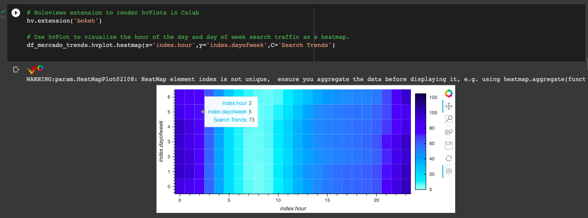

# MercadoLibre_Financials_Time_Series_Analysis
A time series analysis and seasonality projections of MercadoLibre's financials

---

## Technologies

This application is written in Python v. 3.9.7 and uses [JupyterLab](https://jupyter.org/) to deploy the code. This application makes use of
 the following libraries:

[pandas](https://pandas.pydata.org/docs/) was used for data collection, preparation, and analysis.

[hvplot](https://hvplot.holoviz.org/) was used to plot and visualize various data from the portfolio

[pystan](https://pystan.readthedocs.io/en/latest/) was used for statistical modeling

[fbprophet](https://facebook.github.io/prophet/docs/quick_start.html) was used for model fitting and forecasting

[holoviews](https://holoviews.org/user_guide/) was used to render hvplots in jupyter lab

---

## Installation Guide

Prior to running this application, perform the following in the command line to install the required libraries:

`pip install pandas`

`pip install jupyterlab`

`pip install hvplot`

`pip install pystan`

`pip install fbprophet`

`pip install holoviews`

---

## Usage

In order to launch the application, navigate to the MercadoLibre_Finacials_Time_Series_Analysis folder that contains all of the code for this application, and then type into a web browser colab.research.google.com, then upload the forecasting_net_prohpet.ipynb file into the website.

Once the notebook is open, run each cell in the jupyter file to see the resulting anlysis.

Below are the outputs of the plots that were made using hvplot:

---

## Contributors

Robby Odum

Email: rodum012@gmail.com

---

## License

MIT